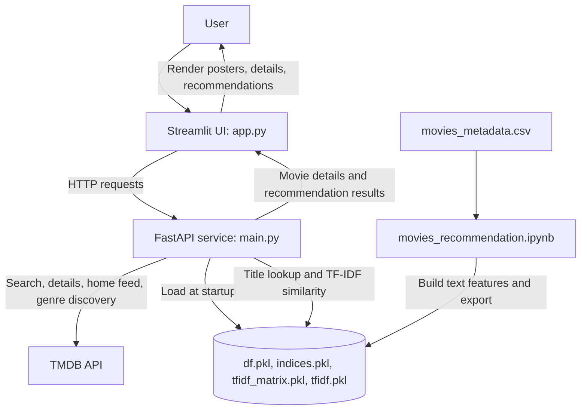

# Movie Recommendation System

A content-based movie recommendation application with a Streamlit interface and a FastAPI backend. Users can browse TMDB movie feeds, search by title, view movie details, and get recommendations based on either movie-text similarity or genre.

## How Recommendations Work

The project combines two recommendation approaches:

- **TF-IDF similarity:** The notebook builds a text field from each movie's overview, genres, and tagline. It removes English stop words, lemmatizes the text, and transforms it with a TF-IDF vectorizer configured for up to 50,000 features and one- and two-word phrases. The API compares a selected movie's sparse vector with the other movie vectors and returns the highest-scoring titles.
- **Genre discovery:** The API looks up the selected movie on TMDB, takes its first listed genre, and asks TMDB Discover for popular movies in that genre.

TMDB also supplies movie search results, posters, details, and the home-page feeds. TF-IDF recommendations come from the local dataset; genre recommendations and display metadata come from TMDB.

## Architecture and Request Flow



The usual interaction is:

1. The Streamlit app requests movie search results or a home feed from the API.
2. The user selects a movie; the app requests its TMDB details.
3. The app requests `/movie/search` for that title. The API resolves a TMDB match, returns its details, computes local TF-IDF recommendations, and requests genre recommendations from TMDB.
4. The app displays the movie details and both recommendation lists.

## Setup

### Requirements

- Python 3.10 or newer
- A TMDB API key for running the FastAPI backend locally

### Install dependencies

From the project root, create and activate a virtual environment, then install the dependencies:

```bash
python3 -m venv .venv
source .venv/bin/activate
python -m pip install --upgrade pip
python -m pip install -r requirements.txt
```

On Windows, activate the environment with `.venv\\Scripts\\activate` instead.

### Run the application with the hosted API

The Streamlit app currently points to the hosted API by default. Start the UI:

```bash
streamlit run app.py
```

Open the local URL printed by Streamlit, usually `http://localhost:8501`.

### Run both services locally

1. Create a `.env` file in the project root and add your TMDB API key:

	```dotenv
	TMDB_API_KEY=your_tmdb_api_key
	```

2. Confirm that the four model files (`df.pkl`, `indices.pkl`, `tfidf_matrix.pkl`, and `tfidf.pkl`) are in the project root. They are loaded by the API when it starts. If they are missing, run `movies_recommendation.ipynb` from the project root to regenerate them from `movies_metadata.csv`.
3. In `app.py`, set `API_BASE` to `"http://127.0.0.1:8000"`. The current expression uses a non-empty hosted URL before `or`, so it will not automatically fall back to localhost.
4. Start the API in one terminal:

	```bash
	uvicorn main:app --reload --host 127.0.0.1 --port 8000
	```

	The API documentation is available at `http://127.0.0.1:8000/docs`, and the health check is `http://127.0.0.1:8000/health`.

5. Start the Streamlit UI in another terminal:

	```bash
	streamlit run app.py
	```

The `.env` file contains a secret and should not be committed.

## Project Files

| File | Purpose |
| --- | --- |
| `app.py` | Streamlit interface for browsing, searching, movie details, and recommendations. |
| `main.py` | FastAPI endpoints, TMDB integration, model loading, and TF-IDF recommendation logic. |
| `movies_recommendation.ipynb` | Data preparation, text preprocessing, TF-IDF model creation, and artifact export. |
| `movies_metadata.csv` | Movie metadata used by the notebook to prepare the local recommendation dataset. |
| `df.pkl`, `indices.pkl`, `tfidf_matrix.pkl`, `tfidf.pkl` | Serialized dataset, title index, TF-IDF matrix, and vectorizer loaded by the API. |
| `requirements.txt` | Python package dependencies for the application and notebook. |

## Main API Endpoints

- `GET /home?category=popular&limit=24` returns a TMDB home feed. Supported categories are `trending`, `popular`, `top_rated`, `now_playing`, and `upcoming`.
- `GET /tmdb/search?query=...` returns TMDB search results.
- `GET /movie/id/{tmdb_id}` returns movie details from TMDB.
- `GET /movie/search?query=...` returns movie details, TF-IDF recommendations, and genre recommendations.
- `GET /recommend/tfidf?title=...` returns recommendations from the local TF-IDF dataset.
- `GET /recommend/genre?tmdb_id=...` returns TMDB recommendations from the selected movie's first genre.